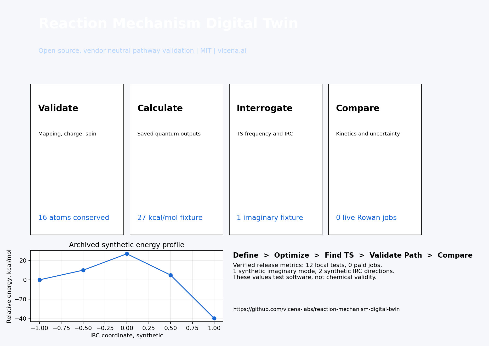

<p align="center"><a href="https://vicena.ai"><strong>Vicena</strong></a></p>
<p align="center"><strong>Built with Vicena</strong><br>Vicena combines AI-assisted research, durable files, Jupyter notebooks, reproducible computation, literature tools, and protected remote scientific compute.</p>

# Reaction Mechanism Digital Twin

A vendor-neutral, calibratable R&D twin for molecular reaction-mechanism analysis, structure and mapping validation, archived quantum-result parsing, reaction-path energetics, thermochemistry, kinetics comparison, uncertainty, method sensitivity, TS acceptance gates, and 3D molecular scenes.

[Installation](#installation) | [60-second example](#60-second-archived-example) | [10-minute analysis](#10-minute-local-analysis) | [Upload](#upload-a-new-reaction) | [Scientific status](#scientific-status) | [AI agent](#use-this-repository-with-an-ai-agent) | [License](#license)

[](Reaction_Mechanism_Digital_Twin_OnePager.pdf)

## What release 0.1.0 provides
- Installable package, schemas, safe archived fixtures, tests, scripts, notebooks, structures, plots, report, and native `*.molscene.json` scene.
- Example: gas-phase 1,3-butadiene plus ethylene to cyclohexene, neutral singlet, conserved $C6H10$, 16 atoms with declared ordering.
- TS acceptance: one relevant imaginary mode, intended displacement, mapping, plausible geometry, and bidirectional path evidence.
- One Rowan product conformer search completed; the TS and IRC ladder was not executed.

## Scientific status
Validation Level 0. The energies, frequency, and IRC arrays are synthetic archived fixtures for testing software behavior. Endpoint geometries are local RDKit MMFF structures. The displayed TS is explicitly a visual midpoint proxy, not a stationary point. Literature describes the parent Diels-Alder reaction as a standard concerted benchmark and reports an activation energy near 27 kcal/mol [Hammoudan et al., 2020](https://doi.org/10.1016/j.heliyon.2020.e04655). A Rowan cyclohexene conformer search completed under UUID `3d530210-368d-4296-9460-94b383d7295a`, charged 0.37 Rowan credits. This endpoint result does not validate the reaction pathway, TS, frequencies, or IRC.

## Installation
Python 3.10 to 3.13 on Linux, macOS, or Windows:
```bash
python -m venv .venv
. .venv/bin/activate
pip install -e .[dev,chem]
```

## 60-second archived example
```bash
python scripts/analyze_archived.py
```
Expected: about 27 kcal/mol activation energy, about -40 kcal/mol reaction energy, and an accepted synthetic logic fixture. This is not a new quantum calculation.

## 10-minute local analysis
```bash
pytest -q
python scripts/validate_reaction.py reactions/example/reaction.json
python scripts/analyze_archived.py
python scripts/generate_assets.py
python scripts/generate_report.py
```
Then open the notebooks, especially `notebooks/07_rowan_product_conformer_analysis.ipynb`, and the native molecular scenes under `results/example/structures/`.

## Upload a new reaction
Create a new folder under `reactions/`. Supply mapped SMILES or structures, native XYZ or SDF coordinates, charge, multiplicity, atom order, solvent, temperature, pressure, concentration or standard state, experimental units, uncertainty, and provenance. Validate against `schemas/`. Never guess missing conditions or compare incompatible phases, solvents, temperatures, or standard states.

## Paid Rowan stages
Rowan stages consume credits and require explicit approval plus a Vicena credit cap. Submissions use the approved unchanged Compute Shell runner with stable task keys and saved UUIDs. Executable notebooks never submit paid jobs. See `docs/ROWAN_WORKFLOWS.md`. The executed sidecar and complete provenance for the product conformer job are stored under `workflows/rowan/` and `results/example/rowan/`.

## Expected outputs
CSV and JSON tables, energy and IRC plots, XYZ or SDF structures, native molecular scenes, TS acceptance report, literature comparison, uncertainty and method sensitivity, Rowan provenance, and a one-page PDF and PNG.

## Failed-workflow interpretation
A converged TS optimization is not acceptance. If frequency, displacement, mapping, geometry, or IRC checks fail, preserve the result and describe the benchmark as partially validated or failed. Do not invent a successful mechanism.

## Documentation, examples, and extension
See `docs/getting-started.md`, `docs/MODEL_CARD.md`, `docs/REACTION_DATA_CONTRACT.md`, `docs/TS_VALIDATION.md`, `docs/ROWAN_WORKFLOWS.md`, `examples/`, `notebooks/`, `CONTRIBUTING.md`, `CHANGELOG.md`, and `RELEASE.md`. New mechanisms belong in new reaction folders with fixtures and tests.

## Limitations
Electronic-structure method error, conformer sampling, standard states, entropy, tunneling, anharmonicity, recrossing, implicit solvent, reaction dynamics, multireference character, atom mapping, and experimental mismatch can change conclusions. Numerical convergence is not chemical validity.

## Citation and versioning
Use `CITATION.cff` and cite the selected scientific methods and datasets. Default-branch examples target version 0.1.0.

## Use this repository with an AI agent
```text
Clone https://github.com/vicena-labs/reaction-mechanism-digital-twin. Read AGENTS.md, AGENT_PLAYBOOK.md, and .agents/skills/reaction-mechanism-twin/SKILL.md. Validate conservation, mapping, charge, and multiplicity. Reproduce the archived baseline before editing. Report methods and units, request approval before paid jobs, reuse Rowan UUIDs, reject a TS without frequency and path validation, and distinguish calculation from experimental evidence.
```
Detailed adaptation prompt:
```text
Clone https://github.com/vicena-labs/reaction-mechanism-digital-twin and read all instructions, schemas, model card, data contract, TS guide, and Rowan guide. Run tests and reproduce the archived baseline. Validate my structures, conservation, atom ordering, mapping, charge, multiplicity, conditions, units, and provenance without guessing. Create a new reaction folder. Compare only compatible calculations and measurements. Before any paid Rowan workflow, propose exact stages and request my Vicena credit cap. Reuse saved UUIDs and preserve failures. Accept no TS without exactly one relevant imaginary mode, displacement evidence, plausible geometry, consistent mapping, and bidirectional IRC or equivalent evidence.
```

## Using this repository with Vicena
Open [Vicena.ai](https://vicena.ai), paste `https://github.com/vicena-labs/reaction-mechanism-digital-twin`, and ask Vicena to read the instructions, run tests, and summarize the validation boundary.

## License
MIT. Third-party literature and user data retain their original terms.
