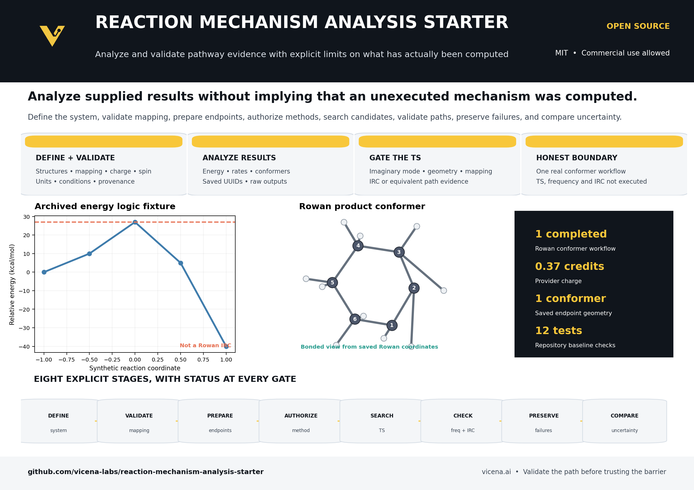
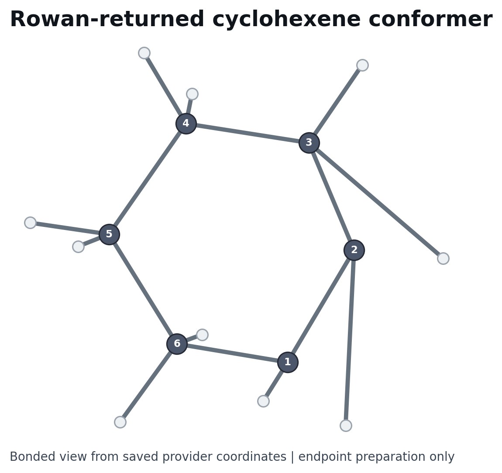
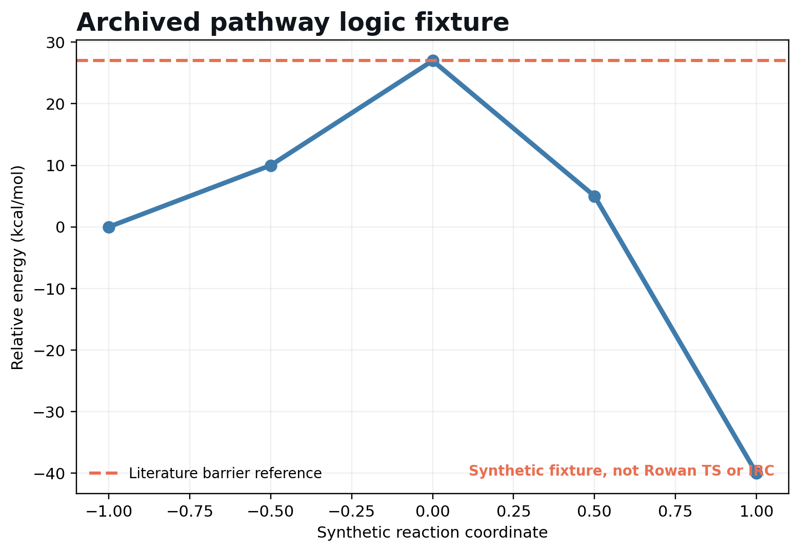

<p align="center">
  <a href="https://vicena.ai"></a>
</p>
<p align="center"><strong>Built with Vicena</strong></p>
<p align="center">Vicena is a scientific research workspace that combines AI-assisted research, durable project files, Jupyter notebooks, reproducible computation, literature tools, and protected remote scientific compute in one environment.</p>

<p align="center">
  
  
  
  
</p>

---

# Reaction Mechanism Analysis and Validation Starter

An open-source starter for validating reaction definitions, analyzing supplied or archived quantum-chemistry results, applying transition-state acceptance gates, comparing kinetics and thermochemistry, preserving failed candidates, and visualizing molecular evidence.

> **Capability boundary:** this repository does not currently compute a new reaction mechanism from reactants and products end to end. The barrier, frequency, and IRC examples are synthetic archived fixtures. The displayed transition state is a geometric midpoint proxy. The only executed Rowan calculation is one cyclohexene conformer search.

[Capability boundary](#capability-boundary) | [Guided workflow](#guided-mechanism-workflow) | [Installation](#installation) | [Quick start](#60-second-archived-example) | [Upload](#upload-a-new-reaction) | [Documentation](#documentation-and-extension) | [AI agent](#use-this-repository-with-an-ai-agent) | [License](#license)

[](Reaction_Mechanism_Analysis_Starter_OnePager.pdf)

## Capability boundary

### Good fit now

- Validate reaction composition, atom mapping, charge, multiplicity, conditions, units, and provenance.
- Parse supplied or archived energy, frequency, IRC, and Rowan result files.
- Calculate energy differences and Eyring or Arrhenius rate estimates.
- Apply a deterministic transition-state acceptance gate to supplied results.
- Analyze one saved Rowan endpoint conformer result and visualize its bonded structure.
- Preserve workflow UUIDs, raw results, failures, assumptions, and uncertainty context.

### Not implemented yet

- Automatic generation of a new mechanism from reactants and products.
- A completed endpoint optimization ladder for both sides of the example reaction.
- A real transition-state search for the example reaction.
- A real frequency calculation establishing a first-order saddle point.
- A real bidirectional IRC calculation connecting the intended endpoints.
- A validated activation free energy or reaction free energy from one consistent quantum-chemistry workflow.

## Visual evidence

| Declared reaction | Executed Rowan endpoint result |
| --- | --- |
|  |  |

The Rowan panel is regenerated from saved provider coordinates. Open the [native interactive molecule scene](results/example/structures/product_rowan_conformer.molscene.json) or rerun [the Rowan analysis notebook](notebooks/07_rowan_product_conformer_analysis.ipynb).



## Guided mechanism workflow

The repository guides users through eight explicit stages. Each stage records whether it is executable locally, demonstrated with real remote output, or awaiting an authorized calculation.

| Stage | User decision or action | Current implementation |
| --- | --- | --- |
| 1. Define | Enter reactants, products, charge, multiplicity, phase, temperature, pressure, solvent, and standard state. | Implemented through reaction manifests and schemas. |
| 2. Validate | Check composition, atom mapping, charge, multiplicity, units, and coordinate provenance. | Implemented and tested. |
| 3. Prepare endpoints | Generate conformers and optimize reactant and product endpoint structures. | Partially demonstrated. One real Rowan product conformer search is bundled. |
| 4. Authorize method | Select method, engine, solvent model, convergence settings, and an explicit credit cap. | Documented with safe Rowan sidecars and approval rules. |
| 5. Search TS candidates | Run bounded scans or double-ended searches and retain every candidate. | Workflow route documented, not executed for the example. |
| 6. Validate frequency and IRC | Require one relevant imaginary mode and endpoint connection evidence. | Acceptance logic implemented against synthetic fixtures. Real workflows not executed. |
| 7. Preserve failures | Save failed candidates, warnings, UUIDs, settings, and rejection reasons. | Repository and provenance contracts implemented. |
| 8. Compare uncertainty | Compare compatible methods, experimental evidence, standard states, and sensitivity. | Local analysis hooks and synthetic examples implemented. |

See [the guided workflow document](docs/GUIDED_WORKFLOW.md) for inputs, completion gates, output files, and remote-compute boundaries.

## What release 0.2.0 provides

- Installable Python package, schemas, validation commands, archived fixtures, tests, scripts, notebooks, structures, plots, reports, and native molecule scenes.
- A gas-phase 1,3-butadiene plus ethylene example with conserved $C6H10$, neutral charge, singlet multiplicity, and declared atom ordering.
- Deterministic TS acceptance logic for supplied results.
- One completed Rowan cyclohexene conformer search, UUID `3d530210-368d-4296-9460-94b383d7295a`.
- An eight-stage guided workflow that clearly marks unexecuted quantum-chemistry stages.

## Scientific status

**Maturity: analysis and validation starter.** The energies, frequency, and IRC arrays are synthetic fixtures for testing software behavior. The displayed TS proxy is not a stationary point. Local endpoint structures are RDKit MMFF geometries. The Rowan result prepares one product conformer only. It does not validate the reaction pathway, transition state, frequencies, thermochemistry, or IRC.

Literature describes the parent Diels-Alder reaction as a standard concerted benchmark and reports an activation energy near 27 kcal/mol [Hammoudan et al., 2020](https://doi.org/10.1016/j.heliyon.2020.e04655). The bundled 27 kcal/mol value is a test fixture based on that reference, not a new calculation.

## Installation

Python 3.10 to 3.13 on Linux, macOS, or Windows:

```bash
python -m venv .venv
. .venv/bin/activate
pip install -e .[dev,chem]
```

## 60-second archived example

```bash
python scripts/analyze_archived.py
```

Expected: approximately 27 kcal/mol activation energy, approximately -40 kcal/mol reaction energy, and an accepted synthetic logic fixture. This proves the analysis code runs. It is not a new quantum calculation.

## 10-minute local analysis

```bash
pytest -q
python scripts/validate_reaction.py reactions/example/reaction.json
python scripts/analyze_archived.py
python scripts/generate_assets.py
python scripts/generate_branded_assets.py
```

Then open `notebooks/07_rowan_product_conformer_analysis.ipynb` and the molecule scenes under `results/example/structures/`.

## Upload a new reaction

Create a new folder under `reactions/`. Supply mapped SMILES or structures, native XYZ or SDF coordinates, charge, multiplicity, atom order, solvent, temperature, pressure, concentration or standard state, experimental units, uncertainty, and provenance. Validate against `schemas/`. Missing scientific metadata must be resolved explicitly, not guessed.

## Remote quantum chemistry

Rowan stages consume credits and require explicit approval plus a Vicena credit cap. Submission occurs from the unchanged Compute Shell runner with stable task keys and saved UUIDs. Executable notebooks never submit paid jobs. See `docs/ROWAN_WORKFLOWS.md` and `workflows/rowan/EXECUTED_JOBS.md`.

## Expected artifacts

The implemented analysis lane produces validated manifests, CSV and JSON tables, energy plots, rate estimates, XYZ or SDF structures, native molecular scenes, acceptance reports, uncertainty summaries, Rowan provenance, and reproducible notebooks. TS structures, frequency results, IRC paths, and free energies are produced only when the corresponding external calculation has actually been executed and collected.

## Documentation and extension

- [Guided mechanism workflow](docs/GUIDED_WORKFLOW.md)
- [Getting started](docs/getting-started.md)
- [Model card](docs/MODEL_CARD.md)
- [Reaction data contract](docs/REACTION_DATA_CONTRACT.md)
- [TS validation](docs/TS_VALIDATION.md)
- [Rowan workflows](docs/ROWAN_WORKFLOWS.md)
- [Agent playbook](AGENT_PLAYBOOK.md)
- [Contributing](CONTRIBUTING.md)

New reactions belong in new folders with provenance, fixtures, tests, and explicit status labels. Do not promote a candidate pathway to validated merely because a calculation converged.

## Limitations

Electronic-structure error, conformer sampling, standard states, entropy, tunneling, anharmonicity, recrossing, implicit solvent, reaction dynamics, multireference character, atom mapping, and experimental mismatch can change conclusions. A successful solver exit proves execution, not chemical validity.

## Citation and versioning

Use `CITATION.cff` and cite every scientific method and dataset used. Default-branch examples target version 0.2.0.

## Use this repository with an AI agent

```text
Clone https://github.com/vicena-labs/reaction-mechanism-analysis-starter. Read AGENTS.md, AGENT_PLAYBOOK.md, and .agents/skills/reaction-mechanism-twin/SKILL.md. Run the tests and archived example. First summarize what is implemented, what is synthetic, and which quantum-chemistry stages have not been executed. Do not claim the repository computes a complete mechanism. Ask for reaction inputs, method choice, and an explicit credit cap before proposing paid Rowan work.
```

Detailed adaptation prompt:

```text
Clone https://github.com/vicena-labs/reaction-mechanism-analysis-starter and follow the eight-stage workflow in docs/GUIDED_WORKFLOW.md. Validate structures, conservation, atom order, mapping, charge, multiplicity, conditions, units, and provenance without guessing. Separate synthetic fixtures, supplied results, and executed calculations. Before remote work, propose the exact method, engine, solvent, convergence settings, workflow stages, and Vicena credit cap. Reuse UUIDs, preserve failed candidates, and accept no transition state without one relevant imaginary mode plus endpoint connection evidence.
```

## Using this repository with Vicena

Open [Vicena.ai](https://vicena.ai), paste `https://github.com/vicena-labs/reaction-mechanism-analysis-starter`, and ask Vicena to read the instructions, run tests, summarize the scientific boundary, and guide you through the eight stages.

## License

MIT. Third-party literature and user data retain their original terms.
